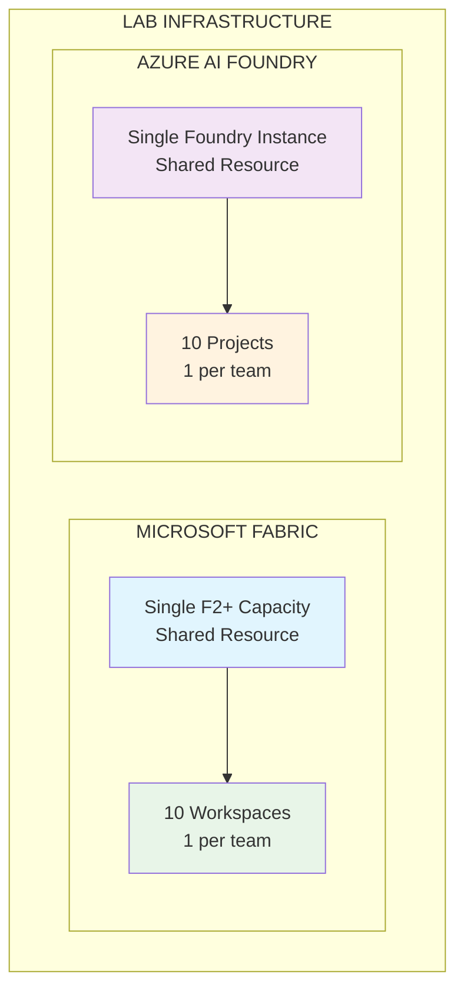
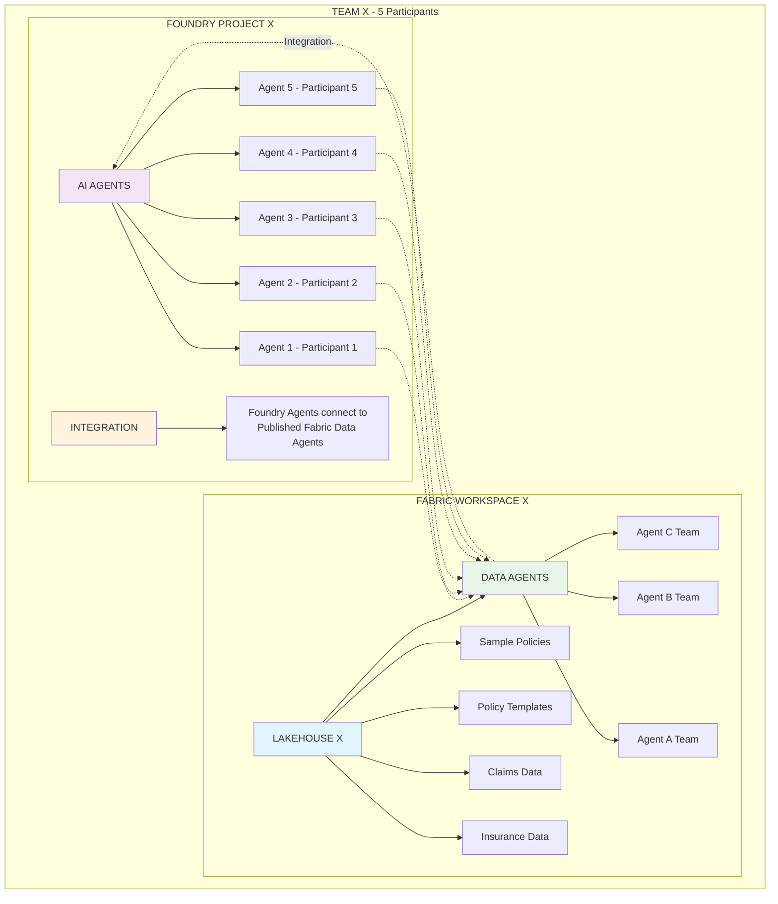
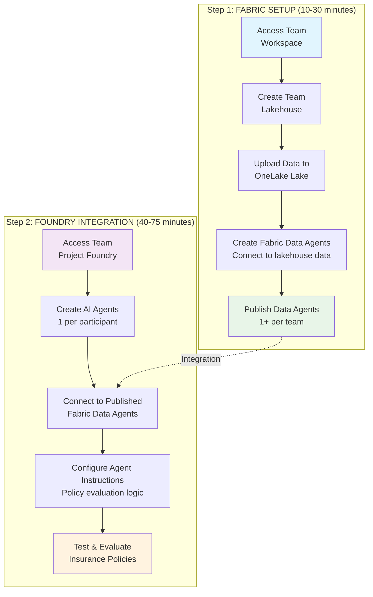

# Lab Architecture Flow Diagram

## High-Level Architecture Overview



## Detailed Team Structure



## Lab Process Flow



**Team Allocation:** 50 Participants → 10 Teams (5 participants each)

## Resource Allocation Matrix

```mermaid
graph TB
    subgraph "SHARED RESOURCES"
        FC[1x Fabric Capacity F2+<br/>Supports all 10 workspaces]
        FI[1x Foundry Instance<br/>Hosts all 10 projects]
    end
    
    subgraph "TEAM ALLOCATION"
        subgraph "Teams 1-5"
            T1[Team 1<br/>fabric-ws-01 | lakehouse-01<br/>1+ agents | foundry-proj-01]
            T2[Team 2<br/>fabric-ws-02 | lakehouse-02<br/>1+ agents | foundry-proj-02]
            T3[Team 3<br/>fabric-ws-03 | lakehouse-03<br/>1+ agents | foundry-proj-03]
            T4[Team 4<br/>fabric-ws-04 | lakehouse-04<br/>1+ agents | foundry-proj-04]
            T5[Team 5<br/>fabric-ws-05 | lakehouse-05<br/>1+ agents | foundry-proj-05]
        end
        
        subgraph "Teams 6-10"
            T6[Team 6<br/>fabric-ws-06 | lakehouse-06<br/>1+ agents | foundry-proj-06]
            T7[Team 7<br/>fabric-ws-07 | lakehouse-07<br/>1+ agents | foundry-proj-07]
            T8[Team 8<br/>fabric-ws-08 | lakehouse-08<br/>1+ agents | foundry-proj-08]
            T9[Team 9<br/>fabric-ws-09 | lakehouse-09<br/>1+ agents | foundry-proj-09]
            T10[Team 10<br/>fabric-ws-10 | lakehouse-10<br/>1+ agents | foundry-proj-10]
        end
    end
    
    FC -.-> T1
    FC -.-> T2
    FC -.-> T3
    FC -.-> T4
    FC -.-> T5
    FC -.-> T6
    FC -.-> T7
    FC -.-> T8
    FC -.-> T9
    FC -.-> T10
    
    FI -.-> T1
    FI -.-> T2
    FI -.-> T3
    FI -.-> T4
    FI -.-> T5
    FI -.-> T6
    FI -.-> T7
    FI -.-> T8
    FI -.-> T9
    FI -.-> T10
    
    style FC fill:#e1f5fe
    style FI fill:#f3e5f5
```

**Allocation Summary:** 50 Participants → 10 Teams (5 participants each)

## Integration Architecture

```mermaid
graph LR
    subgraph "FABRIC SIDE"
        subgraph "Team Lakehouse"
            ID[Insurance Data]
            CH[Claims History]
            PR[Policy Rules]
            TMP[Templates]
        end
        
        PDA[Published Data Agents<br/>1+ per team]
        
        subgraph "Agent Capabilities"
            QI[Query insurance data]
            AP[Analyze policies]
            RA[Risk assessment]
        end
        
        ID --> PDA
        CH --> PDA
        PR --> PDA
        TMP --> PDA
        
        PDA --> QI
        PDA --> AP
        PDA --> RA
    end
    
    subgraph "FOUNDRY SIDE"
        subgraph "Team Project"
            subgraph "Participant Agents"
                A1[Agent 1]
                A2[Agent 2]
                A3[Agent 3]
                A4[Agent 4]
                A5[Agent 5]
            end
            
            subgraph "Playground Testing"
                PC[Playground Chat Testing]
                EX[Example Query:<br/>"Review this policy against guidelines..."]
            end
        end
    end
    
    PDA -.->|Integration Connection| A1
    PDA -.->|Connect to Published<br/>Fabric Data Agents| A2
    PDA -.-> A3
    PDA -.-> A4
    PDA -.-> A5
    
    A1 --> PC
    A2 --> PC
    A3 --> PC
    A4 --> PC
    A5 --> PC
    
    PC --> EX
    
    style PDA fill:#e8f5e8
    style A1 fill:#f3e5f5
    style A2 fill:#f3e5f5
    style A3 fill:#f3e5f5
    style A4 fill:#f3e5f5
    style A5 fill:#f3e5f5
    style PC fill:#fff3e0
```

This architecture ensures:
- **Scalability**: Single capacity serves all teams efficiently
- **Isolation**: Each team has their own workspace and project
- **Collaboration**: Teams can share insights while maintaining separation
- **Integration**: Seamless connection between Fabric and Foundry components
