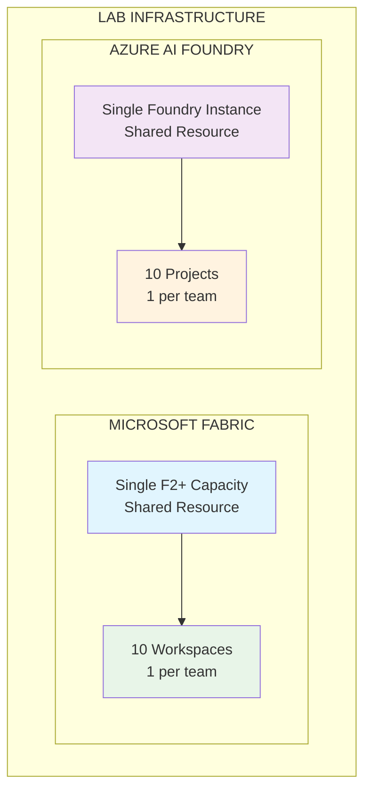
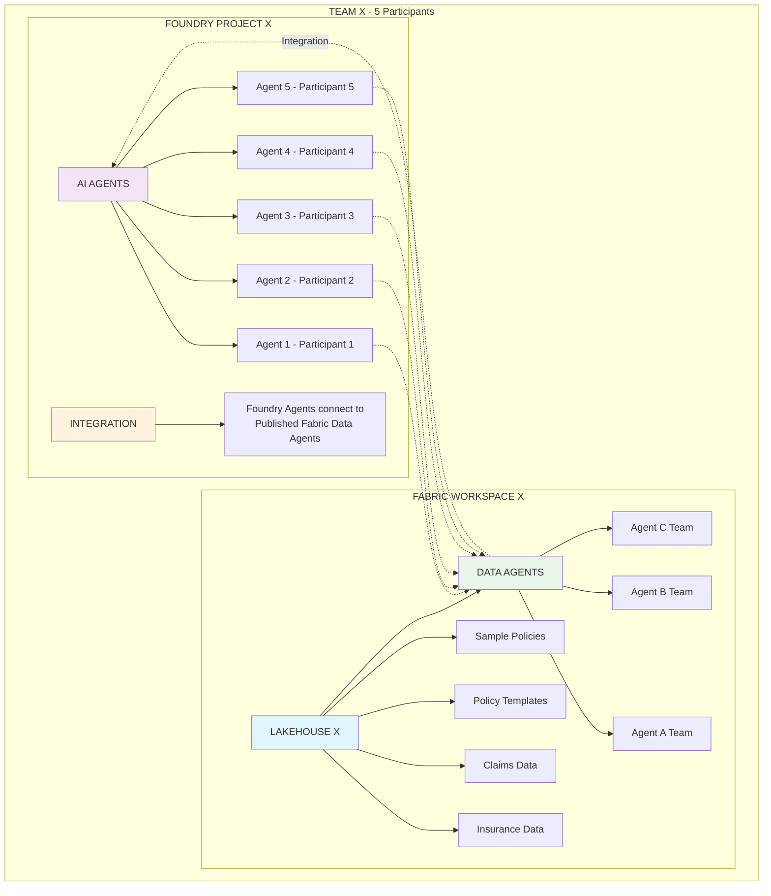
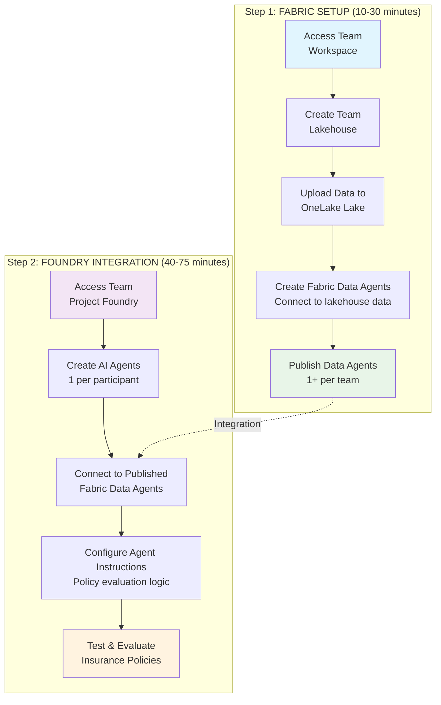
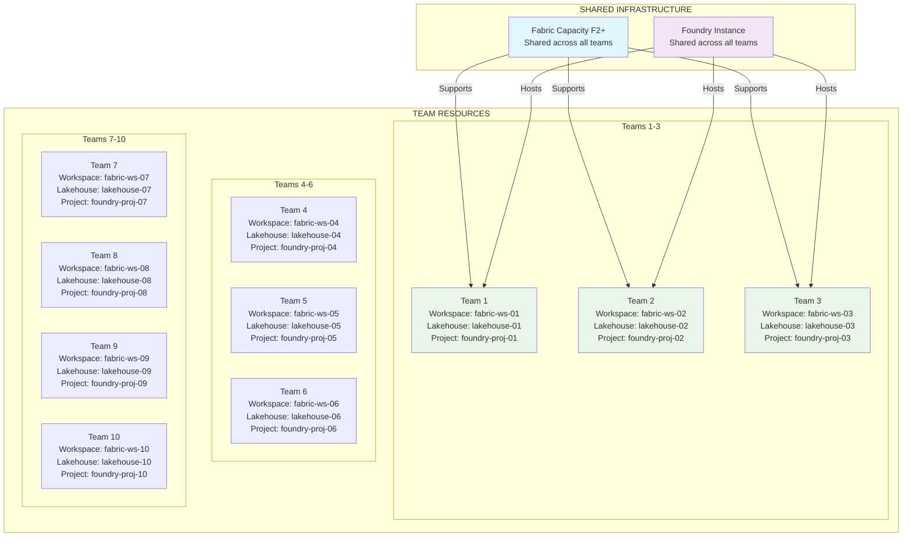
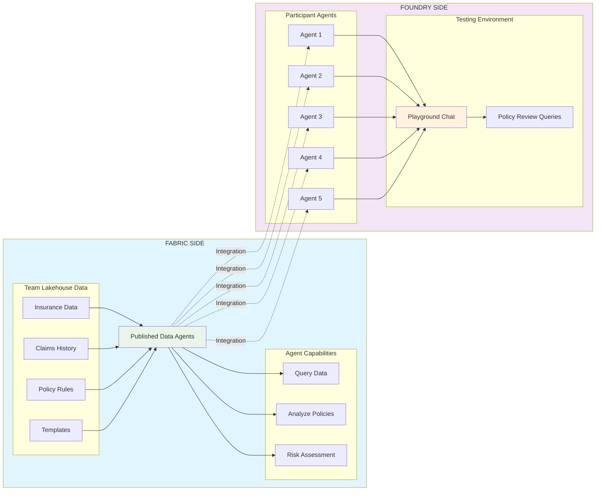
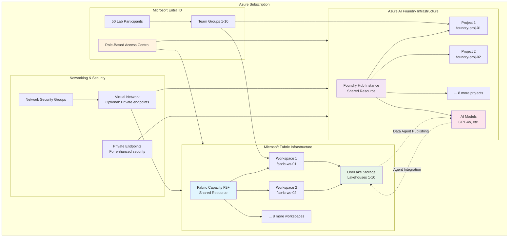

# Lab Architecture Flow Diagram

## High-Level Architecture Overview

## Detailed Team Structure

## Lab Process Flow

**Team Allocation:** 50 Participants → 10 Teams (5 participants each)

## Resource Allocation Matrix

**Resource Summary:**
- **Total Participants:** 50 (5 participants per team)
- **Total Teams:** 10
- **Fabric Workspaces:** 10 (1 per team)
- **Foundry Projects:** 10 (1 per team)
- **Shared Capacity:** 1 Fabric F2+ instance
- **Shared Foundry:** 1 instance

## Integration Architecture

**Integration Flow:**
1. **Data Sources** → Published Data Agents (Fabric side)
2. **Published Agents** → Participant Agents (Foundry side)
3. **Participant Agents** → Playground Testing
4. **Testing** → Policy evaluation and refinement

This architecture ensures:
- **Scalability**: Single capacity serves all teams efficiently
- **Isolation**: Each team has their own workspace and project
- **Collaboration**: Teams can share insights while maintaining separation
- **Integration**: Seamless connection between Fabric and Foundry components

---

## Infrastructure Provisioning Summary

> **For Infrastructure Teams**: This section outlines the Azure services and configurations required to support the lab environment.

### Infrastructure Requirements Checklist

#### **Core Azure Services**
- [ ] **Microsoft Fabric Capacity** (F2 or higher)
  - Supports concurrent workload for 50 users
  - Enables lakehouse and data agent capabilities
  - Estimated cost: ~$8,000-12,000/month for F2
  
- [ ] **Azure AI Foundry Hub**
  - Single shared instance
  - Model deployment capabilities (GPT-4o, GPT-35-turbo)
  - Supports 10 projects with isolation
  
- [ ] **Microsoft Entra ID**
  - 50 user accounts with appropriate licenses
  - 10 security groups for team assignments
  - RBAC configuration for Fabric and Foundry access

#### **Resource Configuration**
- [ ] **Fabric Workspaces**: 10 workspaces (fabric-ws-01 through fabric-ws-10)
- [ ] **Lakehouses**: 10 lakehouses (lakehouse-01 through lakehouse-10)
- [ ] **Foundry Projects**: 10 projects (foundry-proj-01 through foundry-proj-10)
- [ ] **OneLake Storage**: Sufficient capacity for sample datasets (~1GB per team)

#### **Permissions & Access**
- [ ] **Fabric Permissions**: Contributor role for all participants
- [ ] **Foundry Permissions**: Azure AI Developer role for all participants
- [ ] **Team Assignments**: Participants mapped to specific workspace/project pairs
- [ ] **Data Access**: OneLake permissions configured for team isolation

#### **Optional Enhancements**
- [ ] **Private Endpoints**: For enhanced security (enterprise environments)
- [ ] **Virtual Network**: Custom VNET with controlled access
- [ ] **Monitoring**: Application Insights for usage tracking
- [ ] **Backup**: Data retention policies for lab artifacts

### Communication Flows

1. **Authentication**: Entra ID → Fabric/Foundry services
2. **Data Upload**: Participants → OneLake via Fabric workspaces  
3. **Agent Publishing**: Fabric Data Agents → Foundry integration endpoints
4. **Model Access**: Foundry projects → Shared AI model deployments
5. **Cross-Service Integration**: Published agents accessible across Fabric/Foundry boundary

### Estimated Costs (Monthly)
- **Fabric F2 Capacity**: $8,000 - $12,000
- **Azure AI Foundry**: $500 - $1,500 (depends on model usage)
- **Storage (OneLake)**: $50 - $200
- **Networking**: $0 - $500 (if private endpoints used)
- **Total**: ~$8,550 - $14,200/month during lab period

### Post-Lab Cleanup
- [ ] Deprovision Fabric capacity to avoid ongoing costs
- [ ] Archive or delete OneLake data
- [ ] Remove Foundry model deployments
- [ ] Retain project structures for future labs (optional)
